# Goat And Daisy Antique Shop and Restoral Service

Live site is [here](https://goat-and-daisy-antiques.herokuapp.com/).

## Introduction and basic features

An online antique store that provides restoral and repair services,
built using Django. The store uses custom CMS for seperate sales and repair
departments. 

A visitor who wishes to buy does not need to create an account, but
can if she so wishes. A user who wishes to have repairs or restorals done, on
the other hand, must create an account in order to keep track of their specific
requests, materials etc. 

It is recommended to follow **SITE_WALKTHROUGH** for 
better understanding of the site. 

---

### The Customer

The customer can browse the shop and buy items without creating an account
or logging in. Creating an account allows the customers shipping information
to be stored, otherwise there isn't much of a significant benefit as a shop
customer.

As a workshop customer, however, creating an account is essential. This allows
a customer to access a 'workbench' where they can create service tickets, add
images for many reasons, links to materials etc. 

The payment flow is also determined by registered user's choices and Workshop 
Staff.

### The Staff Member

The small staff (not including Admin) at G&D are split into two camps.
Those to do with the shop and those to do with the repairs and restorals.
They have limited permissions to interact with the site functionality
depending on their roles. 

Shop staff manage inventory and handle shippings/orders etc. 

Workshop staff review Service Ticket requests, create quotes and issue invoices.

Admin create staff profiles, manage their permissions and oversee/issue their
todo-lists.

### The Shop

A small online store that sells antique furniture and curiousities. The small
size of the inventory makes it more of a boutique. Customers can buy things
without creating an account. 

Creating an account allows the customer to save delivery information etc.

### The Workshop

The workshop is designed for close collaboration with the staff and customers.
There is also a mutual accountability between staff and customers. Customers
are obligated to create an account, which allows the staff to refer to
style guides that the customer supplies. 

The idea is not to replace an in-person experience, but to provide the 
customer with a more interactive collaboration and have more peace of mind.

---

## The User Experience

Please refer to SITE_WALKTHROUGH.md if you are approaching this site for the
first time. It is highly recommended to get an easier idea of the workflow -
of the Service Ticket and related payment system in particular.

For a more exacting map of User Stories, please view the markdown documents in
Z_DOCS/USER_TESTING. Other than SITE_WALKTHROUGH, all other docs are in 
Z_DOCS)

---

## Features

### The Navbar

The navbar is the key element that distinguishes site function by user privileges.

This is the anonymous user navbar:

And this is the Admin navbar:

### The landing page

Navigating to the site gives a sense of simplicity by keeping the space uncluttered.

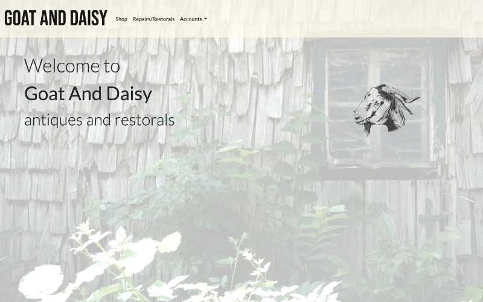

The user isn't overwhelmed by options or sales pitches, but is generously invited to
look at the site in their own time.

### The Shop

A small selection of expensive and beautiful items are shown here. A short description,
link to detailed view, price and an Add To Cart button are provided.

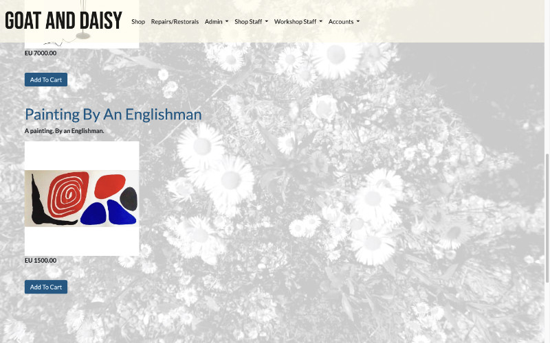

In the detail view, there are more pictures and more extensive descriptions of each item.

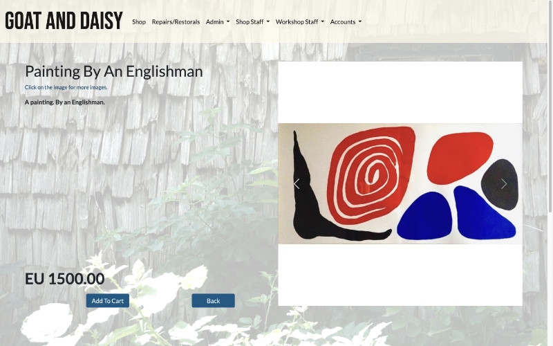

Upon registering and logging in, all users have access to a profile page.

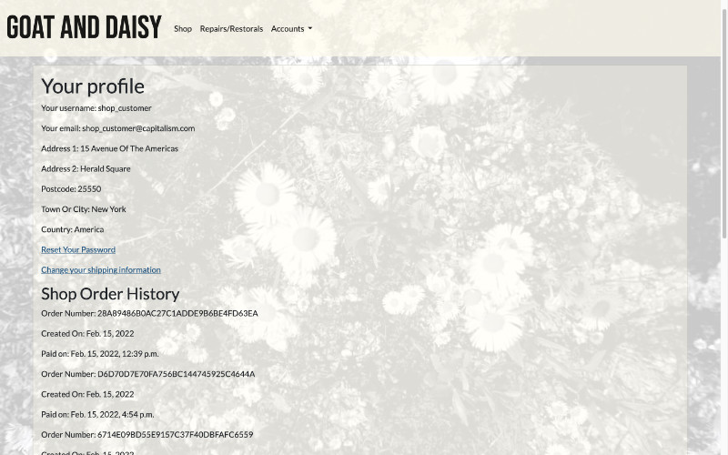

### The Workshop

The Workshop for an anonymous user is a simple description of services.

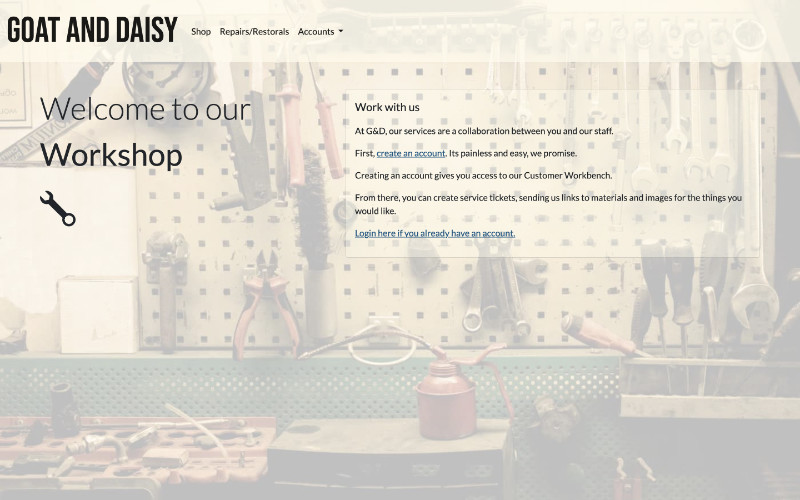

For a registered user, however, it is the portal to a Customer Workbench.

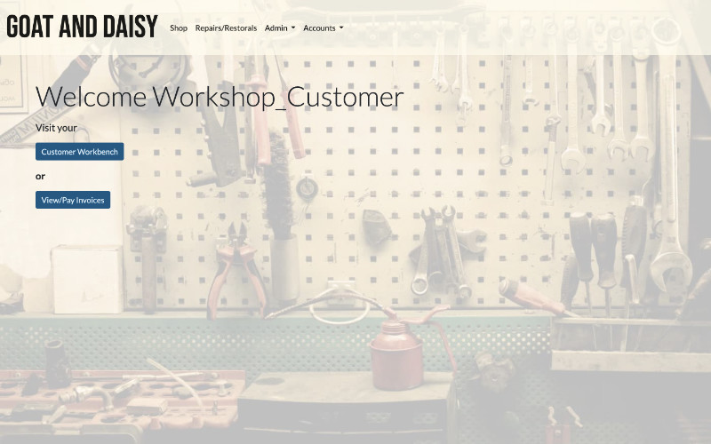

Where one can create a Service Ticket, a key componenent of the site function.

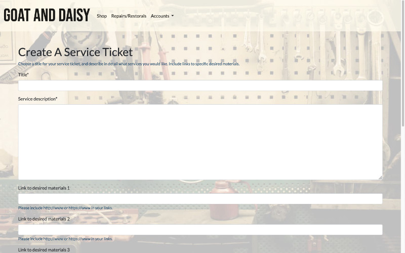

Here, one can manage their outstanding Invoices, which are intertwined with their
Service Ticket and point of contact Workshop Staff member.

### General Staff

At the time of staff member registration, all staff are added to the General
Staff group, which gives them access to these tools:

**Task Manager** - a To-do list type app which has lists created by the staff member
as well as by Admin.

**View All Customers** - an overview of all registered Customers in the database
with some update functionality.

### Shop Staff

When a user with Shop Staff group permissions logs in they have access to their
specific workflow related pages and tools.

Shop Staff have an orders management page and an inventory management portal.

For more information please read the SITE_WALKTHROUGH or USER_TESTING docs.

### Workshop Staff

When a user with Workshop Staff group permission logs in, they too have their
specific pages and tools.

Workshop Staff have a Service Tickets overview and an invoice creation/management
portal.

SITE_WALKTHROUGH and USER_TESTING have more information on the functionality

### Admin and approach to permissions/CMS

Shop and Workshop staff have no access to the Admin panel - they have only the
functions granted to them by the Admin.

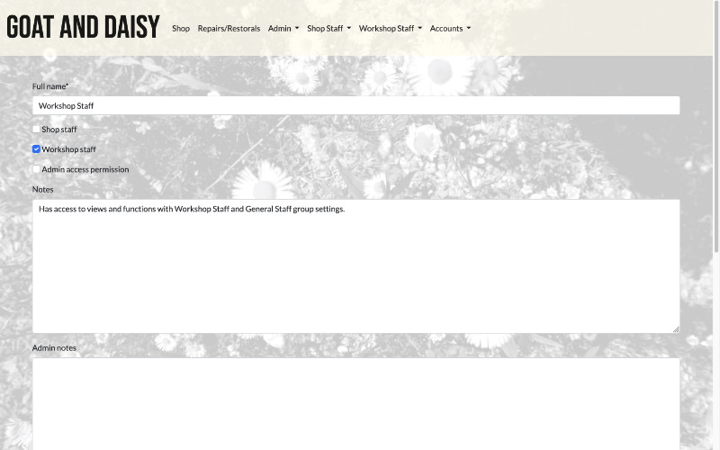

Admin has streamlined Staff Member creation functions, so Admin doesn't have
to struggle with long lists of registered users.

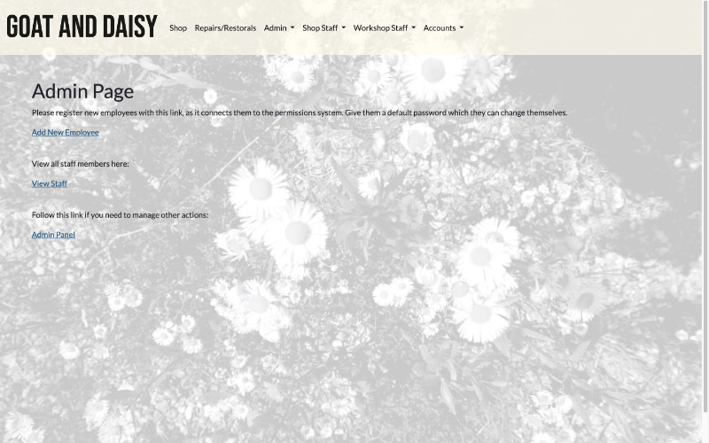

Admin has a Task Manager that allows them to issue tasks to staff members:

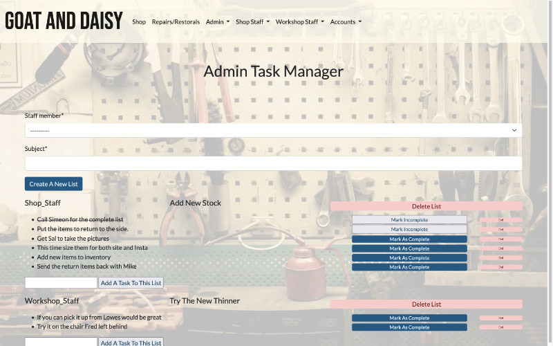

Admin also has an overview of all task lists and progress

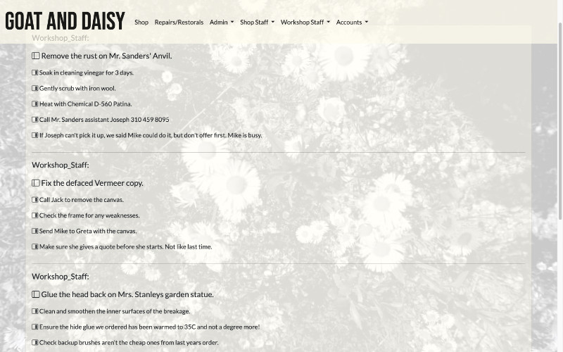

## Design Elements

Design for the app was done mainly around using Bootstrap to quickly make
the functionality presentable and responsive. However, there were certain
aesthetic choices made carefully. 

When the project began, there was little sense of the complexity of it, 
and midway the decision was made to favour back-end functionality rather 
than wireframing and prototyping any front end decisions.

Since this is a full stack project, there was as much care as possible put
into the styling - but the backend was where most of work was.

### Background Images

The bg images were taken by myself, with the exception of the Workshop image.

They set the tone for the spirit of the enterprise. Reducing their opacity to
25% of the original made them unobtrusively allow text and images to sit
on top.

### Font

While Lato has been a favourite from the start, the logo was made using Bebas Neue.

Many fonts including Poppins and Alegreya were tried, but they didn't fit as well
as Lato.

### GSAP Animations

While it was tempting to have the goat ram its head on the left side text, the
animations for the site are slow, soft opacity fades. The wrench in the Workshop
anonymous view moves a bit but won't cause anyone any real harm.

## Database Schematics

Please refere to DB_SCHEMAS.md for a breakdown of the database models.

## Deployment

Please refer to DEPLOYMENT.md for information on Heroku deployment.

## Technologies used

[Django](https://www.djangoproject.com/) was used as the core of the project - instead of using [Django
Rest Framework](https://www.django-rest-framework.org/) or [AllAuth](https://django-allauth.readthedocs.io/en/latest/), the built-in Django equivalents were used.

For deployment, [WhiteNoise](http://whitenoise.evans.io/en/stable/) was used to host media and static files in
the early stages. [Gunicorn](https://gunicorn.org/) and [django-heroku](https://pypi.org/project/django-heroku/) were installed early in the
project and configured with WhiteNoise until the final phase of production.

[Bootstrap5](https://getbootstrap.com/docs/5.0/getting-started/introduction/) and its associated [Crispy Forms Pack](https://github.com/django-crispy-forms/crispy-bootstrap5) were used from the start.
[Bootstrap Icons](https://icons.getbootstrap.com/) were added, but not used in the end.

[Psycopg2](https://pypi.org/project/psycopg2/), [dj_database_url](https://pypi.org/project/dj-database-url/), [django_cors_headers](https://pypi.org/project/django-cors-headers/), [stripe](), [boto3](https://boto3.amazonaws.com/v1/documentation/api/latest/index.html) and
[django-storages](https://django-storages.readthedocs.io/en/latest/) were all added towards the end point.

[AWS](https://aws.amazon.com/free/) S3 was used in the end for static and media files.

[GSAP](https://greensock.com/gsap/) was used to add finishing touches to the front end.

## Wishlist of features

A simple functional suite of running tests that check views and urls
would be essential for this project.

A refactored separation of functions between apps - especially the Task
Manager, since its a handy little tool.
